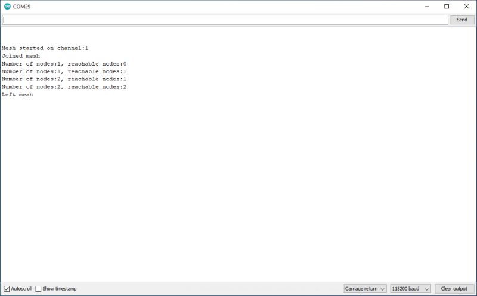

# Join mesh

This is a very simple sketch that starts the mesh and then shows details on the Serial console if a mesh forms. If there is an onboard LED it will also light the LED.

As nodes join and leave the mesh it will show the total number ever seen and how many can currently be reached.



## Method for joining the mesh

You need to include the library and start it with the begin method. Including the library also includes any other necessary libraries such <WiFi.h> and requires no specific setup.

```c++
#include <m2mMesh.h>
bool m2mMesh.begin([uint8_t <maximum mesh size>])
```

The return value is true if the Wi-Fi interface can be brought up and there is enough free memory for the necessary data structures used by m2mMesh.

Optionally you can specify the maximum size of the mesh, which by default is 16 nodes (excluding the current node). If you know the size of the mesh you wish to use you should set this value. The higher the maximum mesh size, the more memory the library uses. The absolute maximum size of the mesh is 254 nodes, but this is untested in practice.

If more nodes exist than the maximum mesh size an incomplete mesh will form and never become stable with some nodes perhaps staying unreachable.

## Method for staying connected to the mesh

```
m2mMesh.housekeeping()
```

In order to send periodic messages that keep the mesh functioning your code needs to run *m2mMesh.housekeeping()* frequently, at least once every ten seconds.

Running it as frequently possible will help reduce latency when forwarding messages across the mesh.

## Methods for checking mesh state

```c++
bool m2mMesh.joined()
uint8_t WiFi.channel()
uint8_t m2mMesh.numberOfNodes()
uint8_t m2mMesh.numberOfReachableNodes()
```

If at least one other node is reachable, the return value from *mesh.joined()* will be true. All nodes in a mesh must be on the same channel so *WiFi.channel()* is useful to show which channel the node started on.

To find the number of nodes seen, use *m2mMesh.numberOfNodes()*. This is all the nodes ever learned about by this node, some of which it may not have actually retrieved messages from but been informed about. This number never reduces.

The number of nodes which are currently considered reachable is returned by *m2mMesh.numberOfReachableNodes()* and can vary as conditions across the mesh change.