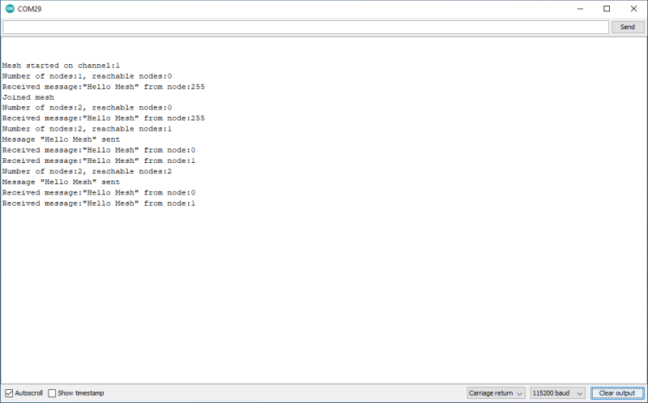

# Hello mesh

This is an extension of example 1 that periodically floods a message to the mesh and if it receives something similar will display it. If you flash it to several nodes you should see the messages being sent and received.

For more detailed examples of sending and receiving data see examples 3 and 4.

