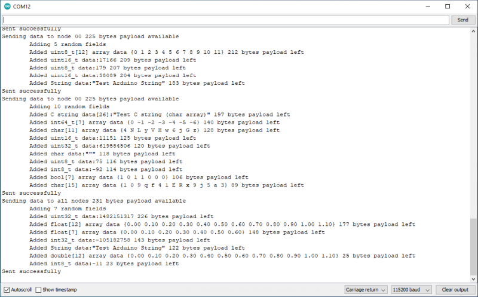

# Send random data types

This sketch floods the mesh with messages containing a random number of fields, of random types.

It serves as a demonstration of sending various data types and works well paired with Example 4 to show the mesh is working.

As the number of fields and their size varies, sometimes there may not be space for all the fields chosen in the message.



## Methods used for add data to the message

The methods are templated functions that accept most built in Arduino data types, either as single items or arrays. The return value is true if there was enough space left in the message for the data. There may be space for smaller fields if a large one fails.

There are 225 bytes available in a message for data with a single destination or 231 bytes if flooded to the whole mesh. Larger items of data will have to be sent in chunks by the application.

The first field of data added causes the message structure to be initialised and further fields are appended until the message is sent, cancelled, or there is no space for the field you are trying to add.

```c++
bool m2mMesh.add(<data>)
bool m2mMesh.add(<array>, [uint8_t <arrayLength>])
```

Supported types are.

```c++
bool
uint8_t		(unsigned short)
uint16_t	(unsigned int)
uint32_t	(unsigned long)
uint64_t	(unsigned long long)
int8_t		(short)
int16_t		(int)
int32_t		(long)
int64_t		(long long)
float		
double
char
String		(Arduino Strings, not C strings)
```

There is a special pseudo-type for NULL-terminated C strings, 'str'. If you omit the array length when passing a C string to *m2mMesh.add(<data>)*, this will be used and the terminating NULL will be stripped during sending, saving a byte in the message. The NULL will be added again on retrieving the data from the field on receipt.

## Methods for sending the message

There is just one method to send.

```c++
bool m2mMesh.send([bool <wait>])
```

The optional 'wait' parameter is whether to wait for a result from the underlying WiFi library before returning to the user application. By default the method waits for feedback and you should normally accept this. If you do not wait and subsequently you code does heavy blocking I/O, the packet may be silently dropped.

The return value is whether the packet was successfully sent or not, which does not guarantee delivery.

## Other methods

```c++
uint8_t m2mMesh.payloadLeft()	//The number of bytes space left in the current message
bool clear();					//Abandons the current message, deleting all added fields
```

