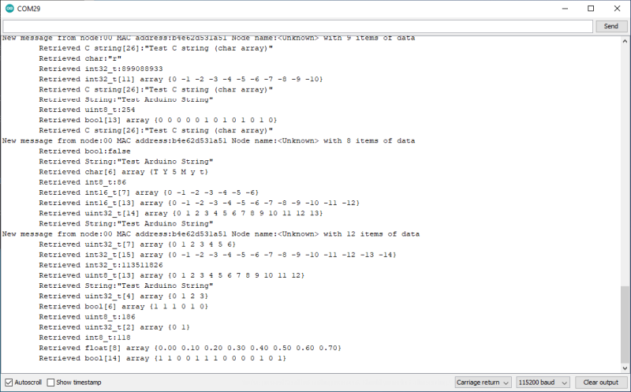

# Display received data

This sketch will show the data fields in any message it receives on the Serial console.

It serves as a demonstration of retrieving the data for all supported data types and may prove useful to debug your own sketches.



## Methods used for receiving data

First, you should check there is a message waiting, data fields are available and what type the next field is.

```
bool m2mMesh.messageWaiting()			//Returns true if there is a message waiting to retrieve fields from
uint8_t m2mMesh.dataAvailable()			//Returns the number of fields left in the message to retrieve
uint8_t m2mMesh.nextDataType()			//Returns a constant indicating the next data type
```

The value returned by *m2mMesh.nextDataType()* is a constant, which indicates the type of the field. If there is no data left, it will return USR_DATA_UNAVAILABLE.

```
USR_DATA_UNAVAILABLE =    0xff;			//Used to denote no more data left
USR_DATA_BOOL =           0x00;			//Used to denote a boolean in user data
USR_DATA_UINT8_T =        0x02;			//Used to denote an uint8_t in user data
USR_DATA_UINT16_T =       0x03;			//Used to denote an uint16_t in user data
USR_DATA_UINT32_T =       0x04;			//Used to denote an uint32_t in user data
USR_DATA_UINT64_T =       0x05;			//Used to denote an uint64_t in user data
USR_DATA_INT8_T =         0x06;			//Used to denote an int8_t in user data
USR_DATA_INT16_T =        0x07;			//Used to denote an int16_t in user data
USR_DATA_INT32_T =        0x08;			//Used to denote an int32_t in user data
USR_DATA_INT64_T =        0x09;			//Used to denote an int64_t in user data
USR_DATA_FLOAT =          0x0a;			//Used to denote a float (32-bit) in user data
USR_DATA_DOUBLE =         0x0b;			//Used to denote a double float (64-bit) in user data
USR_DATA_CHAR =           0x0c;			//Used to denote a char in user data
USR_DATA_STR =            0x0d;			//Used to denote a null terminated C string in user data
USR_DATA_STRING =         0x0e;			//Used to denote a String in user data
USR_DATA_CUSTOM =         0x0f;			//Used to denote a custom field in user data (not yet implemented)
USR_DATA_BOOL_ARRAY =     0xf0;			//Used to denote boolean array in user data
USR_DATA_UINT8_T_ARRAY =  0xf2;			//Used to denote an uint8_t array in user data
USR_DATA_UINT16_T_ARRAY = 0xf3;			//Used to denote an uint16_t array in user data
USR_DATA_UINT32_T_ARRAY = 0xf4;			//Used to denote an uint32_t array in user data
USR_DATA_UINT64_T_ARRAY = 0xf5;			//Used to denote an uint64_t array in user data
USR_DATA_INT8_T_ARRAY =   0xf6;			//Used to denote an int8_t array in user data
USR_DATA_INT16_T_ARRAY =  0xf7;			//Used to denote an int16_t array in user data
USR_DATA_INT32_T_ARRAY =  0xf8;			//Used to denote an int32_t array in user data
USR_DATA_INT64_T_ARRAY =  0xf9;			//Used to denote an int64_t in user data
USR_DATA_FLOAT_ARRAY =    0xfa;			//Used to denote a float array (32-bit) in user data
USR_DATA_DOUBLE_ARRAY =   0xfb;			//Used to denote a double float array (64-bit) in user data
USR_DATA_CHAR_ARRAY =     0xfc;			//Used to denote a char array in user data
```

The  methods for retrieving fields drop into roughly two categories.

First there are those for single items of data that can be easily 'passed by value'. They retrieve each field in the order it was added to the message. They do not indicate success in any way and if you try to read beyond the end of available data they will return 'dummy' data, zero or in the case of a String an empty one.

```
bool m2mMesh.retrieveBool()				//Retrieve a boolean value
uint8_t m2mMesh.retrieveUint8_t()		//Retrieve an uint8_t value
int8_t m2mMesh.retrieveInt8_t()			//Retrieve an int8_t value
uint16_t m2mMesh.retrieveUint16_t()		//Retrieve an uint16_t value
int16_t m2mMesh.retrieveInt16_t()		//Retrieve an int16_t value
uint32_t m2mMesh.retrieveUint32_t()		//Retrieve an uint32_t value
int32_t m2mMesh.retrieveInt32_t()		//Retrieve an int32_t value
uint64_t m2mMesh.retrieveUint64_t()		//Retrieve an uint64_t value
int64_t m2mMesh.retrieveInt64_t()		//Retrieve an int64_t value
float m2mMesh.retrieveFloat()			//Retrieve a floating point value (32-bit)
double m2mMesh.retrieveDouble()			//Retrieve a double precision floating point value (64-bit)
char m2mMesh.retrieveChar()				//Retrieve a char
String m2mMesh.retrieveString()			//Retrieve an Arduino String
```

The second category are for receiving array fields, which are multiple items of a single type. Packing data into fields like this saves on packing overhead and leaves more space in the message.

```
uint8_t m2mMesh.retrieveDataLength()	//Returns the number of array items in the field
bool m2mMesh.retrieveArray(<array>)		//Fills the array passed with the items
bool m2mMesh.retrieveStr(<array>)		//Fills a char array with the C string and null terminates it
```

You must ensure the array you pass *m2mMesh.retrieveArray()* is large enough for the data in the field you are retrieving, no check is done. The return value of the retrieve method is true if there was something to retrieve. A simple retrieve should look something like the code below.

```
uint8_t dataLength = m2mMesh.retrieveDataLength();
uint32_t tempArray[dataLength];
m2mMesh.retrieveArray(tempArray);
```

Null terminated C strings are a slightly special case, where the value *m2mMesh.retrieveDataLength()* returns INCLUDES the terminating null, on the expectation you will use code like this to retrieve the string. It avoids any confusion about adding an extra character for the NULL. When you use *m2mMesh.retrieveStr(<array>)* will ensure the terminating null is ALWAYS added, but the NULL is NOT transmitted across the mesh, to save space packing data.

```
uint8_t dataLength = m2mMesh.retrieveDataLength();  //NB this length INCLUDES the null termination!
char tempArray[dataLength];
m2mMesh.retrieveStr(tempArray); //NB this will be forced to be null terminated!
```

