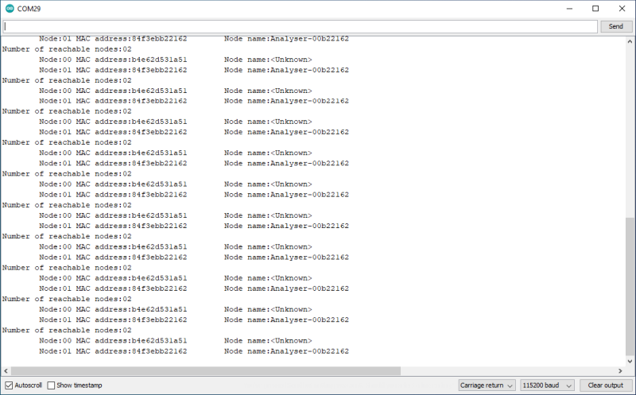

# Set Node Name

This example demonstrates setting the node name and retrieving a list of all the nodes in a mesh, along with their names. Use of node names is essential to making sketches more portable and not relying on MAC addresses for communication, much like the Internet uses DNS.

Node names are only shared every five minutes, so name resolution is not available immediately after the mesh is joined.



## Method for setting the node name

The method is overloaded so a pointer to a null-terminated C string or Arduino String can be used to set the name. There is no specific limit to name length, but it must fit in a mesh message and will consume memory on every node in the mesh. It will only return false if there is no memory available to set the name, which is unlikely.

```c++
bool m2mMesh.setNodeName(<nodeName>)
```

## Methods for checking and retrieving node names

Each node has a table of all other nodes in the mesh, uindexed with a numeric ID. This does not persist across restarts and will be different for each node but can be used to check the existence of or retrieve a pointer to the node name and MAC address. If supplied with no ID it returns the details for the local name.

```c++
bool m2mMesh.nodeNameIsSet(uint8_t <node ID>)
bool m2mMesh.nodeNameIsSet()
char* m2mMesh.getNodeName(uint8_t <node ID>)
char* m2mMesh.getNodeName()
```

## Methods for handling MAC addresses

It is sometimes useful to refer to the MAC address of each node. The library uses the **base** MAC address of the ESP8266/8285/32, not whatever is currently is, which can change if also acting as a SoftAP. This avoids 'duplicates' if the current MAC address of a node changes.

This method copies the **base** MAC address of a node into a uint8_t[6]. When sending messages to that node, the current MAC address, which is sometimes different by a few bits, is used.

```c++
m2mMesh.macAddress(uint8_t <node>,uint8_t* <macaddress>)
```

