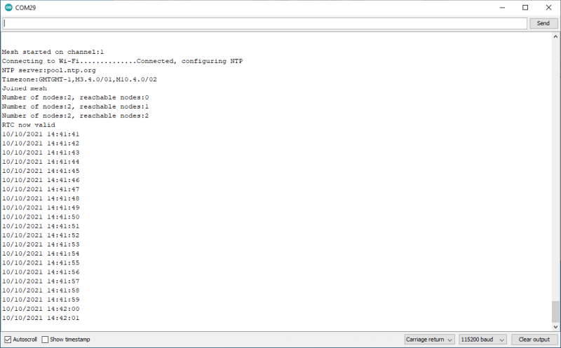

# RTC server

This sketch demonstrates using NTP as an RTC source for the whole mesh, even if only one node can reach Wi-Fi and the internet. More than one node can be configured as an RTC source and the mesh will pick one to work from.

There is an aspiration to add GPS as a time source, as the usual use cases for m2mMesh include locations where there is no permanent Internet connection, but this is not yet implemented.

The shared RTC, like the synced uptime, is 'human scale' so will be right within a second or so. It is not designed for high accuracy use, it is implemented for basic scheduling.



## Methods for configuring RTC

These build on the libraries included in the Espressif IDF for basic NTP and managing time, taking C string values for the time server and timezone.

The timezone is set in the slightly ugly **tzset** format. The timezone for the UK in this format is *"GMTGMT-1,M3.4.0/01,M10.4.0/02"*. There is an aspiration to have a large number of #defines for common timezones in the library to help with setting this.

```c++
void m2mMesh.setNtpServer(char* ntpServer)
void m2mMesh.setTimeZone(char* timeZone)
bool m2mMesh.rtcValid()
```

Once the RTC is configured, the method *m2mMesh.rtcValid()* will return true if the RTC has picked up time from the NTP server. Once it appears valid, it will be considered forever valid on the assumption the underlying IDF routines will keep NTP synchronised.

## Other methods related to being an RTC source

```c++
bool m2mMesh.rtcConfigured()
```

If this node has been configured as an RTC source, rtcConfigured() will return true.

## Using built in time features of the IDF

Once the RTC is set and valid, you typically retrieve it in two different formats, epoch time and localtime.

Epoch time is a measure of the seconds elapsed since 1st January 1970, which isn't human readable and typically most useful as a relative timestamp for events, much like *millis()* or *m2mMesh.syncedMillis()*.

Localtime is a slightly quirky but more useful time format, which you would normally convert epoch time to using code like that below.

```c++
time_t now;	//Value for epoch time
time(&now);	//Retrieves epoch time
struct tm * timeinfo;	//Struct for localtime
timeinfo = localtime(&now);	//Retrieves localtime equivalent for previously retrieved epoch time
```

Once you have localtime, you can reference the various [components of the structure](https://www.cplusplus.com/reference/ctime/tm/) (eg. timeinfo->tm_year gives you the year) and do useful things with them. It is worth looking at the generic [reference for time.h](https://www.cplusplus.com/reference/ctime/) as the ESP library broadly implements this.

To print time in a human readable form, then [strftime](https://www.cplusplus.com/reference/ctime/strftime/) is useful, as per the following example code.

```c++
char timeAndDate[] = "--/--/---- --:--:--";
strftime(timeAndDate, strlen(timeAndDate)+1, "%d/%m/%Y %H:%M:%S", localtime(&timestamp));
Serial.println(timeAndDate);
```

