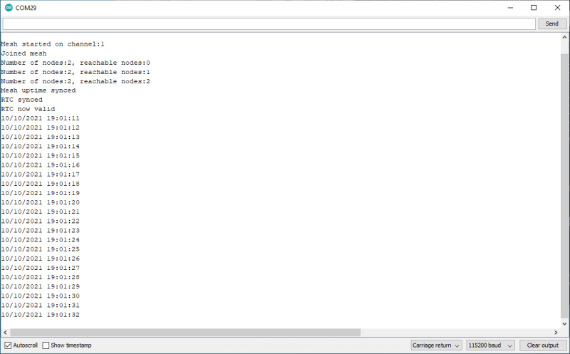

# RTC client

There isn't anything needed to configure an RTC client. The assumption is that if an RTC source is configured on the mesh then all clients may wish to use it. A node configured as an RTC source will never act as an RTC client, even if its own time reference is down.

The RTC is derived from the synced uptime on clients, so will not be available until a node has synced that as well as the RTC source. These may come from different nodes and one may sync before the other.

As soon as **both** uptime and RTC source are synced then the RTC is set and becomes usable. It will be periodically updated by the RTC source and can in principle drift if that does but all nodes using that RTC source should be in sync.



## Method for checking the RTC

Once the RTC is synced and usable, the method *m2mMesh.rtcValid()* will return true. You can then use the standard Espressif IDF time functions, as outlined in the README for example 9.

```c++
bool m2mMesh.rtcValid()
bool m2mMesh.rtcSynced()
```

You can also check if it has received RTC information from the RTC source with *m2mMesh.rtcSynced()*, but this does not mean the RTC is ready for use, the uptime must also be synced.