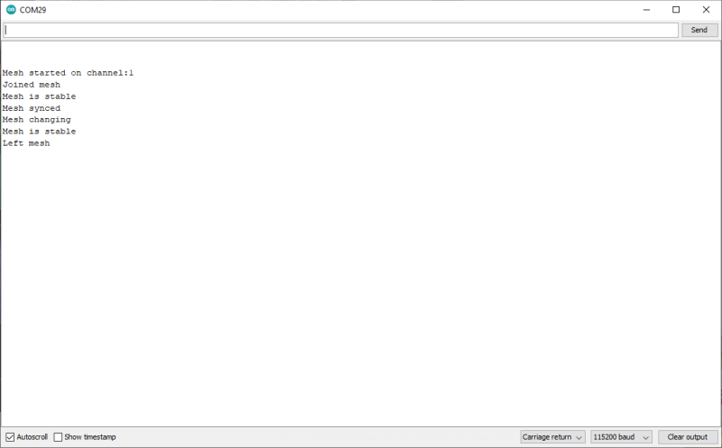

# Event callbacks

All the examples so far have used a very procedural, polling style of handling changes and events across the mesh.

An event based programming style can be more efficient so there is some support for events in m2mMesh. **This should be seen as experimental for now.**



## Methods for using the mesh callback

The callback function must be defined similarly to the one below.

It is passed an argument of the type meshEvent, which can be one of the following.

- meshEvent::joined - This node joined the mesh. It does not mean the whole mesh is routable only that at least one node is.
- meshEvent::left - This node left the mesh. There are no other routable nodes.
- meshEvent::stable - All nodes have the same view of the mesh and consider it to be consisted of the same nodes. Some nodes **may** be unreachable.
- meshEvent::changing - At least one node has a different view of the mesh from this node. This often happens on a node restart.
- meshEvent::complete - Every node can reach every other node ever seen in the mesh. **NOT YET IMPLEMENTED**
- meshEvent::synced - This node has received a sync from the mesh and *syncedMillis()* should be consistent.
- meshEvent::message - This node has received a message to process. It **can** be processed in the callback function but large amounts of blocking I/O should be avoided. Ideally, flag this with a semaphore of some kind that is acted upon in your main *loop()*. See the example for detail.

You don't have to handle all the events, but it is advisable to do so. The callback does not preclude also using the polling functions like *m2mMesh.joined()*, *m2mMesh.stable()*, *m2mMesh.messageWaiting()* and so on.

The callback function can be set (or changed) at any time, but this makes most sense if done before the m2mMesh.begin();

```
bool messageReceived = false;

void meshCallback(meshEvent event)
{
  if(event == meshEvent::joined)  //This station has gone online
  {
    Serial.println("Joined mesh");
    return;
  }
  else if(event == meshEvent::left) //This station has gone offline
  {
    Serial.println("Left mesh");
    return;
  }
  else if(event == meshEvent::stable) //All the nodes have the same view of the mesh
  {
    Serial.println("Mesh is stable");
    return;
  }
  else if(event == meshEvent::changing) //At least one node has changed
  {
    Serial.println("Mesh changing");
    return;
  }
  else if(event == meshEvent::complete) //Every node can reach every other node
  {
    Serial.println("Mesh complete");
    return;
  }
  else if(event == meshEvent::synced) //Uptime synced with the mesh
  {
    Serial.println("Mesh synced");
    return;
  }
  else if(event == meshEvent::message)  //Message received
  {
    messageReceived == true;
    return;
  }
  return;
}

void setup() {
  ...
  m2mMesh.setCallback(meshCallback);  //Set the callback function
  ...
  }
```

